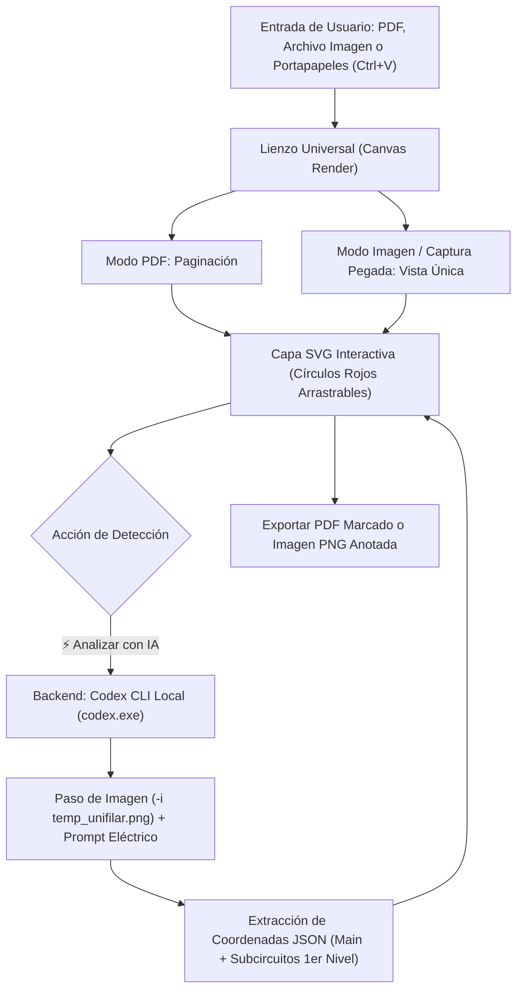

# Plan de Implementación: Soporte para Carga y Pegado de Imágenes (Ctrl+V) y Motor Local Codex CLI

## Descripción del Objetivo (Goal Description)

El objetivo de esta actualización es evolucionar la aplicación **Circuit Analyzer** para responder a dos necesidades operativas clave:
1. **Soporte Universal de Imágenes y Pegado desde Portapapeles (`Ctrl+V`)**:
   - Permitir cargar no solo archivos PDF, sino también **imágenes directas** (`.png`, `.jpg`, `.jpeg`, `.webp`, `.bmp`).
   - Habilitar la función de **pegar imágenes directamente con `Ctrl+V`**: un ingeniero podrá tomar una captura de pantalla de un diagrama unifilar en AutoCAD, Revit, Bluebeam, EPLAN o el navegador (usando `Win + Shift + S`) y pegarla al instante en el lienzo de la aplicación sin tener que guardar un archivo intermedio.
   - Exportación flexible: permitir descargar el resultado tanto en **PDF anotado** como en **Imagen de alta resolución (PNG)** con los círculos vectoriales estampados.
2. **Motor de Inferencia Local y Soberano con Codex CLI**:
   - Operar de forma 100% local sin depender de APIs externas en la nube.
   - Integrar **Codex CLI local** (`codex-cli 0.155.0-alpha.9.2` en `C:\Users\lasrv\AppData\Local\OpenAI\Codex\bin\...\codex.exe`).
   - El backend ejecuta la inferencia localmente llamando al binario de Codex CLI con soporte nativo de imágenes (`-i <image_path>`) y esquema JSON estructurado para devolver la posición del Main y de los subcircuitos de primer nivel.

---

## Puntos Clave

> [!IMPORTANT]
> 1. **Detección Automática de Codex CLI**:
>    - El backend detecta automáticamente el binario oficial de Codex CLI instalado localmente.
>    - La aplicación opera de manera **100% local y soberana**, sin enviar planos a la nube.
> 2. **Manejo de Pegado (`Ctrl+V`)**:
>    - Al presionar `Ctrl+V` en cualquier parte de la ventana con una imagen en el portapapeles, el lienzo se actualiza automáticamente con la nueva imagen, conservando todas las herramientas de zoom, marcado manual, arrastre de círculos y análisis.

---

## Componentes

### Componente 1: Backend Local (FastAPI + Codex CLI)
- `backend/services/codex_analyzer.py`:
  - Localizador dinámico del binario `codex.exe`.
  - Guardado temporal de la imagen analizada (`temp_diagram.png`).
  - Ejecución mediante `subprocess` llamando a `codex exec -i temp_diagram.png --skip-git-repo-check ...`.
  - Parseo y validación de la respuesta estructurada en formato JSON (`MainBreaker` y `Subcircuits`).
- `backend/main.py`:
  - Endpoint `GET /api/codex-status`.
  - Endpoint `POST /api/upload`: soporte de imágenes y PDFs.
  - Endpoint `POST /api/export-image` y `POST /api/export-pdf`.

### Componente 2: Frontend Universal (PDF + Imágenes + Ctrl+V)
- `frontend/src/components/PdfCanvasViewer.tsx`:
  - Soporte dual: PDF con `pdfjsLib` o imagen con renderizado en Canvas y capa vectorial SVG.
- `frontend/src/App.tsx`:
  - Listener global de evento `paste` (`Ctrl+V`).
  - Gestión integral de estados y exportación dual (PNG y PDF).
